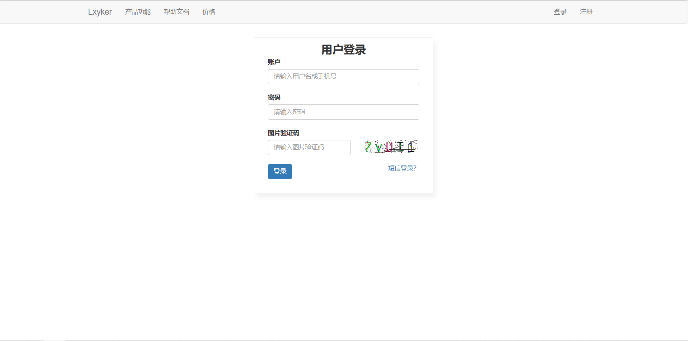
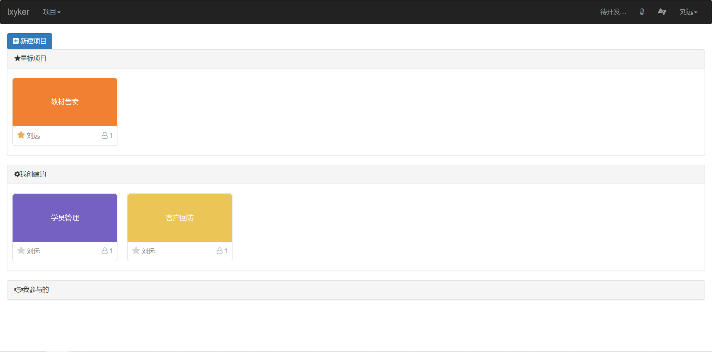
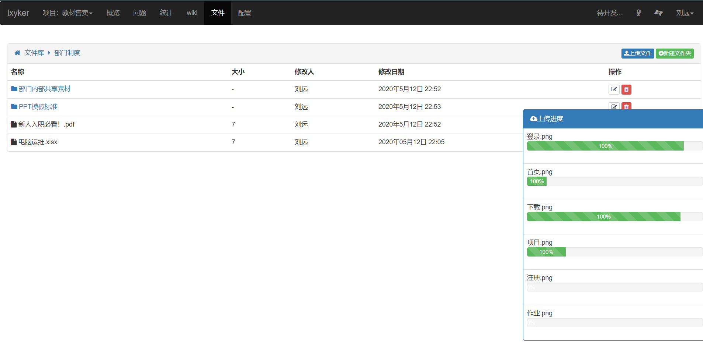
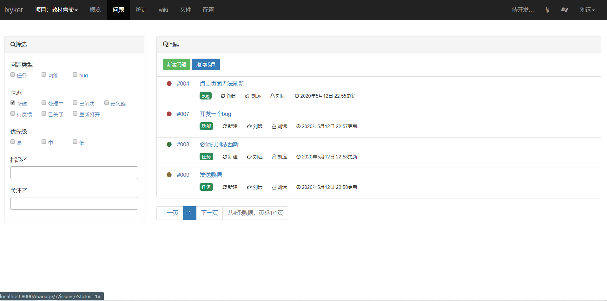
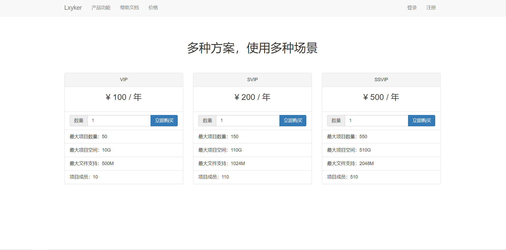

# TaskPlatform

该项目是一个简易版的任务发布平台系统。其目的主要是为中小型团队提供简洁、高效的 Bug 追踪，轻量、便捷的项目管理以及安全、稳定的数据保障。

## 依赖环境

```bash
CentOS 7
python 3.7
django 1.11.29
MySql
redis
django-redis
腾讯云对象存储		pip install -U cos-python-sdk-v5
支付宝支付		pip install alipay-sdk-python==3.3.398
```

## 预览

- 用户注册/登录：



- 项目管理：


- 文件管理：

  

- 任务追踪：

  

- 价格购买

  